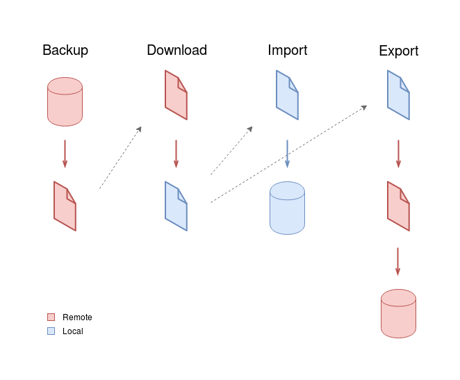

# Ansible playbooks

Initial hint: [configure Ansible globally to show human-readable output](https://github.com/ansible/ansible/issues/27078#issuecomment-364560173)

## Configuration

### Project setup

In `group_vars/all.yaml`, change `project_name` and `server_git_url`

### Servers setup

In `inventory.yaml` add each server as an entry in `all.children.remote.hosts`

## Requirements

- [Install Ansible](https://docs.ansible.com/ansible/latest/installation_guide/intro_installation.html). Currently requires Ansible 2.8
- Run `ansible-galaxy install -r requirements.yaml` to install other requirements.

## Usage

To setup or update a server, run:
```sh
ansible-playbook -i inventory.yaml -l <host_or_group> deploy.yaml
```
with host_or_group from inventory. (It can also be run from another directories, but requires paths for yaml files)

### Quickstart

Because the deploy needs to run the quickstart script, it was converted to an Ansible role. So `quickstart.sh` now installs the requirements and runs only the quickstart role. Some variables are set in `inventory.yaml` to make it work.

### DB



- `backup-db` works as in Fabric.
- `download-db` always takes a new backup and downloads that (if you want to download a previous one, just use `scp`).
- `import-db` by default imports a fresh backup. You can specify a local dump file in the `dump_name` variable (example: `ansible-playbook ... import-db.yaml -e dump_name=staging/2019-08-22.dump`).
- `export-db` can be used in two modes:
    - Export local dump to *host_B*: `ansible-playbook ... --limit host_B export-db.yaml -e local_dump=staging/2019-08-22.dump`
    - Export remote dump from *host_A* to *host_B*: `ansible-playbook ... --limit host_A,host_B export-db.yaml`

## Notes

- DB name is assumed to be the same as `project_name` (to avoid parsing `local_settings.py`)
- Remote DB dumps are assumed to be stored in `~/db_dumps/`
